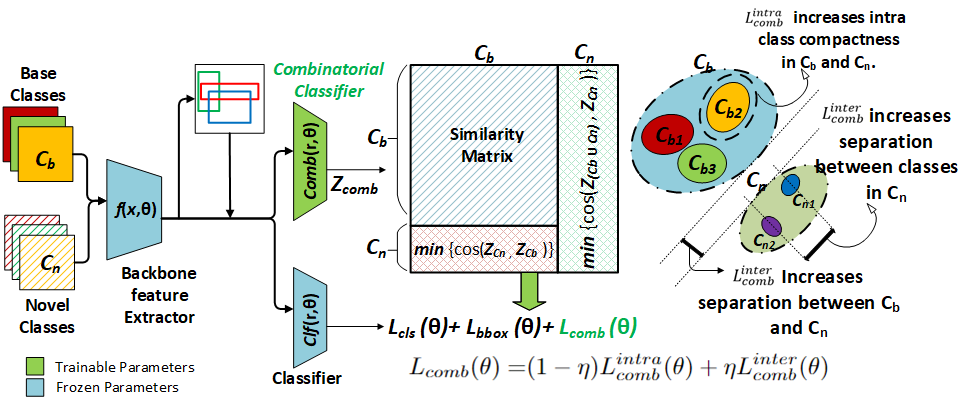

# SMILe: Leveraging Submodular Mutual Information For Robust Few-Shot Object Detection

This repo contains the implementation of proposed SMILe framework which introduces a combinatorial viewpoint in Few-Shot Object Detection. SMILe is built upon the codebase [DiGeo](https://github.com/Phoenix-V/DiGeo).



Confusion and forgetting of object classes have been challenges of prime interest in Few-Shot Object Detection (FSOD).
To overcome these pitfalls in metric learning based FSOD techniques, we introduce a novel Submodular Mutual Information Learning (**SMILe**) framework which adopts combinatorial mutual information functions to enforce the creation of tighter and discriminative feature clusters in FSOD.
Our proposed approach generalizes to several existing approaches in FSOD, agnostic of the backbone architecture demonstrating elevated performance gains.
A paradigm shift from instance based objective functions to combinatorial objectives in SMILe naturally preserves the diversity within an object class resulting in reduced forgetting when subjected to few training examples.
Furthermore, the application of mutual information between the already learnt (base) and newly added (novel) objects ensures sufficient separation between base and novel classes, minimizing the effect of class confusion.
Experiments on popular FSOD benchmarks, PASCAL-VOC and MS-COCO show that our approach generalizes to State-of-the-Art (SoTA) approaches improving their novel class performance by up to 5.7\% (3.3 $mAP$ points) and 5.4\% (2.6 $mAP$ points) on the 10-shot setting of VOC (split 3) and 30-shot setting of COCO datasets respectively. 
Our experiments also demonstrate better retention of base class performance and up to $2\times$ faster convergence over existing approaches agnostic of the underlying architecture.

## Installation

Our code is developped based upon [TFA](https://github.com/ucbdrive/few-shot-object-detection) and please follow their instructions for library (pytorch, detectron2) installization and dataset preparation.
Following steps can be followed to achieve the optimal result (based on author suggestions) :
- Install pillow for image processing : ```pip install pillow=9.1.0```
- Installing Detectron2 : ```python -m pip install detectron2 -f https://dl.fbaipublicfiles.com/detectron2/wheels/cu113/torch1.10/index.html```
- ```conda install pytorch==1.10.0 torchvision==0.11.0 torchaudio==0.10.0 cudatoolkit=11.3 -c pytorch -c conda-forge```
- ```pip install setuptools==59.5.0```
- For the library/package used for running the code, the repo has been verified on Pytorch 1.7~1.10. For the instillation of detectron2, we install the pre-compiled version following the instructions [here](https://detectron2.readthedocs.io/en/latest/tutorials/install.html).
- For the dataset preparation, we would recommend to organize the data in a shared storage server in your own GPU clusters (if applicable) and then crerate a soft link towards the root with the destination as 'datasets'.


## Getting Started

Our framework consists of two steps. We first pre-train the detector with fixed margin (i.e., Prior) and then perform self-distillation to adaptively adjust the margins. 

### Pre-Training (Prior) with Command Line

To pre-train a model, select the right config under ``configs`` which has the keyword `pre` in the filename. For your convenience, you can run the code in the sh file by 
```angular2html
sh scripts/prior.sh
```

The checkpoints of pre-training can be found [here](https://drive.google.com/drive/folders/1w4tcRiiqYL9Z80lYBQOuNQhZGUl0v4l_?usp=share_link).  We hope our checkpoints can be used as initialization for the future development. To skip the pre-training step, you can directly download the linked folder at the root of this repo and make sure to rename the downloaded folder as `checkpoints`. 

### Prepare the checkpoints for self-distillation stage 

After pre-training, it is needed to clean the saved checkpoints to be used for the self-distillation stage. The command is 
```angular2html
python tools/ckpt_clean.py
```

### Self-Distillation Stage with Command Line

To perform the distillation stage, simply run 
```angular2html
sh scripts/distill.sh
```
To note, the configuration of distillation inherites the corresponding configuration of pre-training, in particular, the parameters for loss calculation and for ckpt loading & initialization.

## Inference Demo with Pre-trained Models

The pre-trained checkpoints can be found in `Demo` under [here](https://drive.google.com/drive/folders/1w4tcRiiqYL9Z80lYBQOuNQhZGUl0v4l_?usp=share_link). Please put it under `checkpoints/${dataset}/distill`.

The testing command is provided in an sh file and please run
```angular2html
sh scripts/demo.sh
```

### Acknowledgement
We thank the authors of the below mentioned contributions. 
Most of our code is adapted from the imTED approach.

 DiGeo: Discriminative Geometry-Aware Learning for Generalized Few-Shot Object Detection ([DiGeo](https://arxiv.org/abs/2303.09674))
