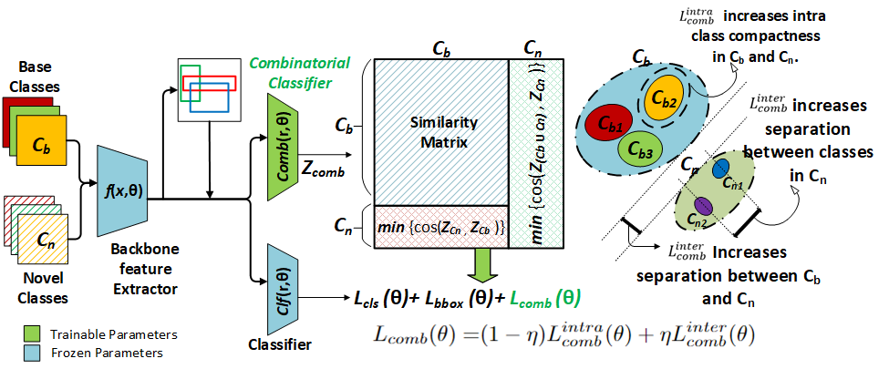

# SMILe: Leveraging Submodular Mutual Information For Robust Few-Shot Object Detection

This repo contains the implementation of proposed SMILe framework which introduces a combinatorial viewpoint in Few-Shot Object Detection. SMILe is built upon the codebase of [PDC](https://github.com/Bohao-Lee/PDC). Note that PDC is based on the mmdetection repostory providing diverse models to work with.



Confusion and forgetting of object classes have been challenges of prime interest in Few-Shot Object Detection (FSOD).
To overcome these pitfalls in metric learning based FSOD techniques, we introduce a novel Submodular Mutual Information Learning (**SMILe**) framework which adopts combinatorial mutual information functions to enforce the creation of tighter and discriminative feature clusters in FSOD.
Our proposed approach generalizes to several existing approaches in FSOD, agnostic of the backbone architecture demonstrating elevated performance gains.
A paradigm shift from instance based objective functions to combinatorial objectives in SMILe naturally preserves the diversity within an object class resulting in reduced forgetting when subjected to few training examples.
Furthermore, the application of mutual information between the already learnt (base) and newly added (novel) objects ensures sufficient separation between base and novel classes, minimizing the effect of class confusion.
Experiments on popular FSOD benchmarks, PASCAL-VOC and MS-COCO show that our approach generalizes to State-of-the-Art (SoTA) approaches improving their novel class performance by up to 5.7\% (3.3 $mAP$ points) and 5.4\% (2.6 $mAP$ points) on the 10-shot setting of VOC (split 3) and 30-shot setting of COCO datasets respectively. 
Our experiments also demonstrate better retention of base class performance and up to $2\times$ faster convergence over existing approaches agnostic of the underlying architecture.

## Installation
The installation instructions are similar to PDC but with specific modifications as described below.

* Linux with Python >= 3.6
```
conda create --name pdc python=3.9.13
```
[PyTorch](https://pytorch.org/get-started/locally/) : 
```conda install pytorch==1.10.0 torchvision==0.11.0 torchaudio==0.10.0 cudatoolkit=11.3 -c pytorch -c conda-forge```
* Install mmcv from mmlabs
```
pip install -U openmim
mim install mmengine
mim install "mmcv-full>=1.2.4, <1.4.0"
```
* Install Cython```pip install cython==0.29.33```
* [fvcore](https://github.com/facebookresearch/fvcore/): ```pip install timm fvcore yapf==0.40.1```
* Install Apex library
```
git clone https://github.com/NVIDIA/apex
cd apex
pip install -v --disable-pip-version-check --no-cache-dir --no-build-isolation --global-option="--cpp_ext" --global-option="--cuda_ext" ./
```
* Install and Build the PDC repository
```
pip install -v -e .
```
* [OpenCV](https://pypi.org/project/opencv-python/), optional, needed by demo and visualization ```pip install opencv-python```


## Data preparation

We adopt the same benchmarks as in FsDet, including three datasets: PASCAL VOC, COCO and LVIS. 

- [PASCAL VOC](http://host.robots.ox.ac.uk/pascal/VOC/): We use the train/val sets of PASCAL VOC 2007+2012 for training and the test set of PASCAL VOC 2007 for evaluation. We randomly split the 20 object classes into 15 base classes and 5 novel classes, and we consider 3 random splits. The splits can be found in [fsdet/data/datasets/builtin_meta.py](fsdet/data/datasets/builtin_meta.py).
- [COCO](http://cocodataset.org/): We use COCO 2014 without COCO minival for training and the 5,000 images in COCO minival for testing. We use the 20 object classes that are the same with PASCAL VOC as novel classes and use the rest as base classes.
- [LVIS](https://www.lvisdataset.org/): We treat the frequent and common classes as the base classes and the rare categories as the novel classes.

The datasets and data splits are built-in, simply make sure the directory structure agrees with [datasets/README.md](datasets/README.md) to launch the program. 

The default seed that is used to report performace in research papers can be found [here](http://dl.yf.io/fs-det/datasets/).

## Train & Inference

### Training

We follow the eaact training procedure of imTED and follow the two-stage training strategy as discussed below:

#### 1. Stage 1: Training base detector.

```
CUDA_VISIBLE_DEVICES=0 bash tools/dist_train.sh \
        configs/imted/few_shot/voc/imted_faster_rcnn_vit_base_2x_base_training_voc_split1.py 1
```

#### 2. Stage 2: Few-Shot Adaptation on novel data.
Finetuning for the imTED + SMILe model - 
```
CUDA_VISIBLE_DEVICES=0 bash tools/dist_train.sh \
        configs/imted/few_shot/voc/split1/imted_faster_rcnn_vit_base_2x_finetuning_10shot_voc_split1.py 1 FLQMI
```
Finetuning for the PDC + SMILe model -
```
CUDA_VISIBLE_DEVICES=0 bash tools/dist_train.sh \
        configs/imted/few_shot_pdc/voc/split1/imted_ss_faster_rcnn_vit_base_2x_finetuning_10shot_voc_split1.py 1 FLQMI
```

#### Evaluation

To evaluate the trained models, run

```angular2html
CUDA_VISIBLE_DEVICES=0 bash tools/dist_test.sh \
        configs/imted/few_shot_pdc/voc/split1/imted_ss_faster_rcnn_vit_base_2x_finetuning_10shot_voc_split1.py \
        work_dir/imted_ss_faster_rcnn_vit_base_2x_finetuning_10shot_voc_split1/epoch_30.pth \
        1 --eval bbox
```

### Acknowledgement
We thank the authors of the below mentioned contributions. 
Most of our code is adapted from the imTED approach.

Integrally Migrating Pre-trained Transformer Encoder-decoders for Visual Object Detection ([imTED](https://github.com/LiewFeng/imTED))

Proposal Distribution Calibration for Few-Shot Object Detection ([PDC](https://github.com/Bohao-Lee/PDC))
